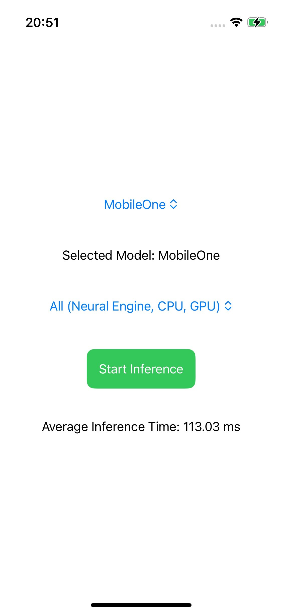

# iOSBenchmark App

This is an iOS app designed to benchmark the performance of various CoreML models on different hardware configurations (CPU, GPU, and Neural Engine). The app dynamically loads available models from the app bundle and allows the user to select the desired hardware for inference.

## Features

- **Model Selection**: Dynamically lists all available CoreML models in the app bundle.
- **Hardware Selection**: Choose between running the inference on CPU, GPU, or Neural Engine.
- **Inference Benchmark**: Measure and display the average inference time over multiple runs.
- **User Feedback**: The app provides visual feedback when inference is running.

## How It Works

1. The user selects a CoreML model from the dropdown menu.
2. The user selects the hardware configuration (CPU, GPU, Neural Engine) from another dropdown.
3. Pressing the "Start Inference" button begins the inference process.
4. The app performs inference 100 times and calculates the average time per run.
5. The average inference time is displayed in milliseconds.

## Requirementsv

- iOS 17.2 or later
- Xcode 15 or later
- iPhone 13 Mini or later (to take full advantage of the Neural Engine)

## Installation

1. Clone the repository from GitHub:
   ```bash
   git clone https://github.com/tbuechler/iOSBenchmark.git
   ```
2. Open the project in Xcode:
   ```bash
   cd iOSBenchmark
   open iOSBenchmark.xcodeproj
   ```
3. Add your CoreML models (.mlmodel) to the app bundle.
4. Build and run the project on a compatible iPhone or simulator.

## Example Image

Below is a screenshot of the app, showcasing the model selection, hardware options, and the inference time display:

<div align="center">
    
</div>

## Usage

1. Open the app and select a CoreML model from the dropdown.
2. Choose the hardware on which you want to run the inference (CPU, GPU, Neural Engine).
3. Press the "Start Inference" button to begin the benchmarking process.
4. The app will display the average inference time in milliseconds.

## License

This project is licensed under the MIT License. See the `LICENSE` file for more details.
